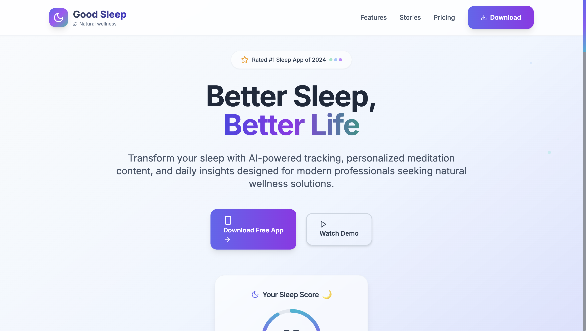
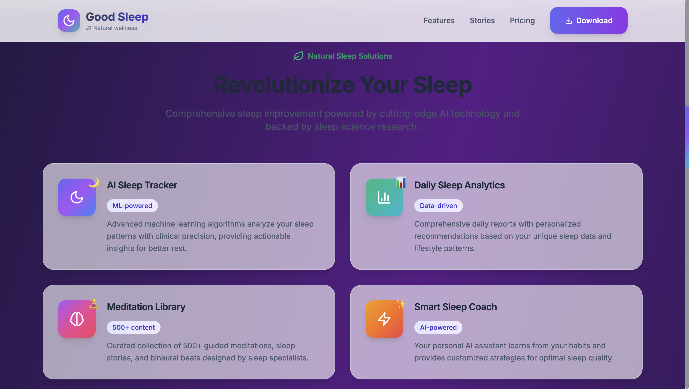
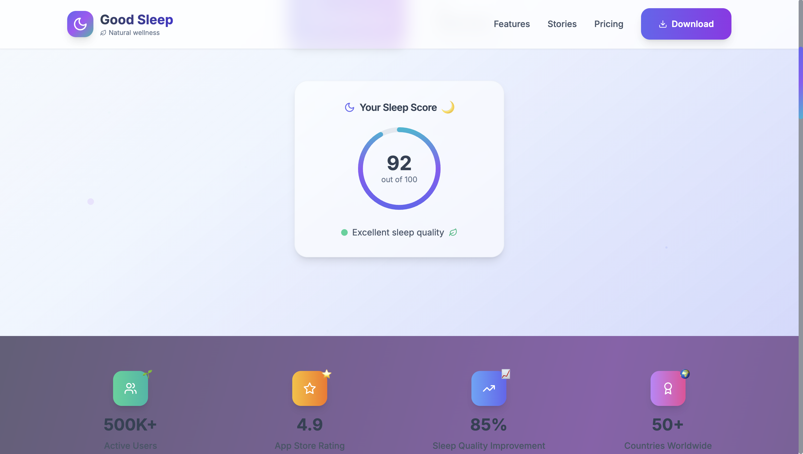
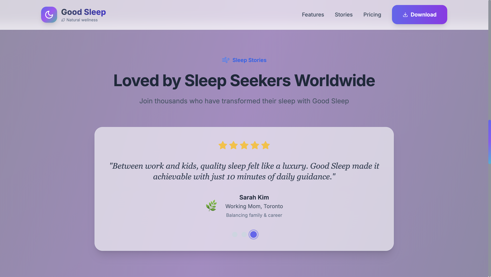
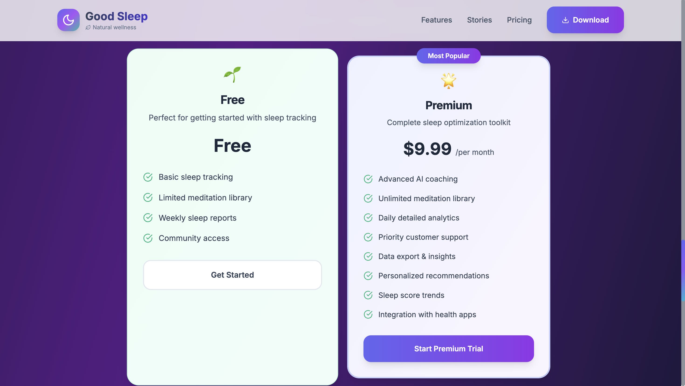

# Good Sleep - Sleep Healthcare App Landing Page 🌙
A modern, responsive landing page for a fictional sleep healthcare application built with Next.js and Tailwind CSS, designed with a nature-inspired wellness theme for global users seeking better sleep quality.

🔗 Live Demo
## 🌐 https://.vercel.app

## ✨ Features
- 🌿 Nature-inspired wellness design with glassmorphism effects
- 📊 Interactive sleep score visualization with animated progress
- 🧘‍♀️ AI-powered sleep tracking and meditation library showcase
- 🎨 Soft color palette with calming gradients and transitions
- 📱 Responsive design optimized for all devices
- ⭐ Auto-rotating testimonials from global users
- 🎯 Modern pricing section with feature comparison
- 🌙 Custom favicon matching brand identity
- ♿ Accessibility features with reduced motion support
- 🌍 Global audience targeting (digital nomads, remote workers)

## 🚀 Tech Stack
- Next.js 14 (App Router)
- React with TypeScript
- Tailwind CSS
- Lucide React Icons
- Google Fonts (Inter + Crimson Text)
- Git & GitHub
- Vercel

## 📸 Screenshots






## 🛠️ Getting Started
```bash
git clone https://github.com/jinhyun-dev/good-sleep-landing.git
cd good-sleep-landing/good-sleep-app
npm install
npm run dev
```

Open [http://localhost:3000](http://localhost:3000) with your browser to see the result.

## 📦 Development Commands
```bash
# Development server
npm run dev

# Build for production
npm run build

# Start production server
npm start

# Type checking
npm run type-check

# Linting
npm run lint
```

## 🎨 Design System
- **Color Palette**: Nature-inspired emerald, blue, and purple gradients
- **Typography**: Inter (primary) + Crimson Text (serif accents)
- **Effects**: Glassmorphism with backdrop blur and transparency
- **Animations**: Floating elements and gentle micro-interactions
- **Theme**: Wellness-focused with calming, serene aesthetic

## 📁 Project Structure
```
good-sleep-app/
├── app/
│   ├── globals.css
│   ├── layout.tsx
│   └── page.tsx
├── components/
│   ├── Header/
│   ├── Hero/
│   ├── Stats/
│   ├── Features/
│   ├── Testimonials/
│   ├── Pricing/
│   ├── CTA/
│   └── Footer/
├── public/
│   ├── favicon.svg
│   └── favicon.ico
└── package.json
```

## 🎯 Target Audience
- **Primary**: Digital nomads and remote workers
- **Secondary**: Health-conscious professionals (20-40 years old)
- **Tertiary**: Working parents seeking better sleep quality

## 📦 Deployment
Deployed on Vercel with automatic deployments from main branch.

## 🧑‍💻 Author
GitHub: @jinhyun-dev

---

**Note**: This is a fictional product created for portfolio demonstration purposes. Good Sleep is not a real application or service.